# Refresh Token Grant

The Refresh Token grant allows applications to obtain new access tokens without requiring the user to re-authenticate. This is essential for maintaining long-lived sessions while keeping access tokens short-lived for security.

## Overview of Refresh Token Grant

Refresh tokens are long-lived credentials issued alongside access tokens during the initial authorization. When an access token expires, the application can use the refresh token to obtain a new access token without user interaction, providing a seamless experience.

**Use Cases:**
- **Long-lived Sessions**: Keep users logged in for days or weeks without requiring re-authentication
- **Mobile Applications**: Maintain authentication across app restarts and background states
- **Single-Page Applications**: Silently refresh expired tokens without disrupting the user experience
- **Desktop Applications**: Allow users to remain authenticated between sessions
- **Background Sync**: Enable periodic data synchronization even when the user is not actively using the app

**Why Use Refresh Tokens:**
Access tokens are intentionally short-lived (typically 1 hour) to limit the impact of token theft. Refresh tokens allow applications to obtain fresh access tokens without forcing users to log in repeatedly, balancing security with usability.

**Key Benefits:**
- **Improved Security**: Short-lived access tokens reduce the window of opportunity for token misuse
- **Seamless User Experience**: Users stay logged in without frequent re-authentication
- **Revocable**: Refresh tokens can be revoked server-side to immediately terminate access
- **Rotation Support**: Refresh tokens can be rotated on each use for enhanced security
- **Offline Access**: Some systems allow refresh tokens to work even when the user is offline

## Refresh Token Flow

```mermaid
sequenceDiagram
    participant User
    participant App as Application<br/>(SPA/Mobile)
    participant Storage as Secure Storage<br/>(sessionStorage/Keychain)
    participant AuthServer as Authorization Server<br/>(Haste Health OAuth)
    participant API as FHIR API<br/>(Resource Server)

    Note over User,API: Initial Authentication (Authorization Code + PKCE + offline_access)
    
    User->>App: Click "Login"
    
    App->>App: Generate code_verifier<br/>(43-128 random characters)
    App->>App: Create code_challenge<br/>SHA256(code_verifier)
    App->>App: Generate state
    
    App->>Storage: Store code_verifier & state
    
    App->>User: Redirect to authorization endpoint
    Note over App,User: /authorize?response_type=code<br/>client_id=app-id<br/>scope=openid offline_access patient/*.read<br/>code_challenge=CHALLENGE<br/>code_challenge_method=S256
    
    User->>AuthServer: GET /w/{tenant}/oauth/api/v1/authorize
    
    AuthServer->>User: Show login page
    User->>AuthServer: Enter credentials
    AuthServer->>User: Show consent screen<br/>(including offline access)
    User->>AuthServer: Grant permissions
    
    AuthServer->>App: Redirect to callback<br/>?code=AUTH_CODE&state=STATE
    
    App->>Storage: Retrieve code_verifier
    
    App->>AuthServer: POST /w/{tenant}/oauth/api/v1/token
    Note over App,AuthServer: grant_type=authorization_code<br/>code=AUTH_CODE<br/>code_verifier=VERIFIER<br/>client_id=app-id
    
    AuthServer->>AuthServer: Verify code_verifier<br/>SHA256 matches challenge
    
    AuthServer->>App: Return tokens
    Note over AuthServer,App: {<br/>  "access_token": "...",<br/>  "refresh_token": "...",<br/>  "expires_in": 3600,<br/>  "scope": "openid offline_access..."<br/>}
    
    App->>Storage: Store access_token (memory)<br/>Store refresh_token (secure storage)<br/>Store expires_at timestamp<br/>Clear code_verifier
    
    App->>User: User authenticated
    
    rect rgb(240, 248, 255)
        Note over User,API: Using Access Token
        
        User->>App: Request patient data
        App->>App: Check token expiration
        
        App->>API: GET /w/{tenant}/{project}/api/v1/fhir/r4/Patient<br/>Authorization: Bearer ACCESS_TOKEN
        
        API->>API: Validate access token<br/>Check expiration
        
        API->>App: Return FHIR resources
        App->>User: Display data
    end
    
    rect rgb(255, 250, 240)
        Note over User,API: Access Token Expired
        
        User->>App: Request more data
        App->>App: Check token expiration<br/>Token is expired!
        
        App->>Storage: Retrieve refresh_token
        
        App->>AuthServer: POST /w/{tenant}/oauth/api/v1/token
        Note over App,AuthServer: Content-Type: application/x-www-form-urlencoded<br/>grant_type=refresh_token<br/>refresh_token=REFRESH_TOKEN<br/>client_id=app-client-id
        
        AuthServer->>AuthServer: Validate refresh token<br/>Check if revoked<br/>Verify client_id<br/>Generate new tokens
        
        alt Refresh Token Rotation Enabled
            AuthServer->>AuthServer: Generate new refresh token<br/>Invalidate old refresh token
            AuthServer->>App: Return new tokens
            Note over AuthServer,App: {<br/>  "access_token": "NEW_TOKEN",<br/>  "refresh_token": "NEW_REFRESH",<br/>  "expires_in": 3600<br/>}
        else No Rotation
            AuthServer->>App: Return new access token
            Note over AuthServer,App: {<br/>  "access_token": "NEW_TOKEN",<br/>  "expires_in": 3600<br/>}
        end
        
        App->>Storage: Update access_token<br/>Update refresh_token (if rotated)<br/>Update expires_at
        
        App->>API: Retry with new access token<br/>Authorization: Bearer NEW_ACCESS_TOKEN
        
        API->>App: Return FHIR resources
        App->>User: Display data (seamless!)
    end
    
    rect rgb(255, 240, 240)
        Note over User,API: Refresh Token Invalid/Expired
        
        User->>App: Request data
        App->>App: Access token expired
        
        App->>AuthServer: POST /oauth/token<br/>(use refresh token)
        
        AuthServer->>AuthServer: Refresh token invalid,<br/>expired, or revoked
        
        AuthServer->>App: Error: invalid_grant
        
        App->>Storage: Clear all tokens
        App->>User: Redirect to login page
    end
```



## Flow Steps in Detail

### Step 1: Obtaining a Refresh Token

Refresh tokens are issued during the Authorization Code Grant with PKCE flow when you include the `offline_access` scope:

**Authorization Request (include offline_access):**
```http
GET /w/{tenant}/oauth/api/v1/authorize?
  response_type=code&
  client_id=your-app-id&
  redirect_uri=https://yourapp.com/callback&
  scope=openid+profile+email+offline_access+patient/*.read&
  state=random-state&
  code_challenge=SHA256_CHALLENGE&
  code_challenge_method=S256
```

**Key Parameters:**
- `offline_access` - **Required** to receive a refresh token
- `code_challenge` - **Required** PKCE challenge for security
- `code_challenge_method=S256` - **Required** SHA-256 hash method

**Token Exchange Request:**
```http
POST /w/{tenant}/oauth/api/v1/token
Content-Type: application/x-www-form-urlencoded

grant_type=authorization_code&
code=AUTH_CODE&
redirect_uri=https://yourapp.com/callback&
client_id=your-app-id&
code_verifier=ORIGINAL_VERIFIER
```

**Token Response (with refresh token):**
```json
{
  "access_token": "eyJhbGciOiJSUzI1NiIsInR5cCI6IkpXVCJ9...",
  "token_type": "Bearer",
  "expires_in": 3600,
  "refresh_token": "eyJhbGciOiJSUzI1NiIsInR5cCI6IkpXVCJ9...",
  "scope": "openid profile email offline_access patient/*.read",
  "id_token": "eyJhbGciOiJSUzI1NiIsInR5cCI6IkpXVCJ9..."
}
```

**Important:** Refresh tokens are only issued when:
- ✅ **Authorization Code Grant with PKCE**: Yes, when `offline_access` scope is requested
- ✅ **User grants offline access permission**: Yes, if consent screen is shown
- ❌ **Client Credentials Grant**: No (request new token instead)
- ❌ **Without offline_access scope**: No refresh token issued

### Step 2: Storing the Refresh Token

Store refresh tokens securely based on your application type.

### Step 3: Using the Refresh Token

When the access token expires, exchange the refresh token for a new access token:

**Request:**
```http
POST /w/{tenant}/oauth/api/v1/token HTTP/1.1
Host: api.haste.health
Content-Type: application/x-www-form-urlencoded

grant_type=refresh_token&
refresh_token=REFRESH_TOKEN_HERE&
client_id=your-client-id
```

**For Confidential Clients (with client_secret):**
```http
POST /w/{tenant}/oauth/api/v1/token HTTP/1.1
Host: api.haste.health
Content-Type: application/x-www-form-urlencoded
Authorization: Basic base64(client_id:client_secret)

grant_type=refresh_token&
refresh_token=REFRESH_TOKEN_HERE
```

**Parameters:**

| Parameter | Required | Description |
|-----------|----------|-------------|
| `grant_type` | Yes | Must be `refresh_token` |
| `refresh_token` | Yes | The refresh token received from the initial authorization |
| `client_id` | Yes | Your application's client identifier |
| `scope` | Optional | Requested scopes (must be subset of original scopes) |

### Step 4: Refresh Token Response

**With Rotation (New Refresh Token):**
```json
{
  "access_token": "eyJhbGciOiJSUzI1NiIsInR5cCI6IkpXVCJ9...",
  "token_type": "Bearer",
  "expires_in": 3600,
  "refresh_token": "eyJhbGciOiJSUzI1NiIsInR5cCI6IkpXVCJ9...",
  "scope": "openid profile email patient/*.read"
}
```

**Note:** Refresh token rotation is enabled by default, the old refresh token is invalidated and a new one is issued.

## Refresh Token Rotation

Refresh token rotation is a security best practice where each refresh token is single-use. After using a refresh token, it's invalidated and a new one is issued.


## Error Handling

### Token Refresh Errors

| Error Code | Description | Resolution |
|------------|-------------|------------|
| `invalid_grant` | Refresh token is invalid, expired, or revoked | Clear tokens and redirect to login |
| `invalid_client` | Client authentication failed | Verify client_id (and client_secret if confidential) |
| `invalid_request` | Missing or malformed required parameter | Check grant_type and refresh_token parameters |
| `unauthorized_client` | Client not authorized to use refresh tokens | Contact administrator to enable refresh tokens |
| `unsupported_grant_type` | Server doesn't support refresh_token grant | Use `grant_type=refresh_token` |

### Example Error Response

```json
{
  "error": "invalid_grant",
  "error_description": "The refresh token has expired or been revoked",
  "error_uri": "https://api.haste.health/errors/invalid_grant"
}
```

## Comparison with Other Flows

| Feature | Refresh Token | Authorization Code | Client Credentials |
|---------|---------------|--------------------|--------------------|
| **Purpose** | Renew access tokens | Initial user login | M2M authentication |
| **User Interaction** | None | Required | None |
| **Requires Initial Auth** | Yes | N/A (is initial auth) | No |
| **Token Lifetime** | Long (days/weeks) | Short (minutes) | N/A |
| **Can Be Revoked** | Yes | N/A | Yes (revoke access token) |
| **Rotation Supported** | Yes (recommended) | N/A | N/A |
| **Best For** | Long sessions | First-time auth | Service accounts |

## Resources

- [OAuth 2.0 RFC 6749 - Refresh Token](https://datatracker.ietf.org/doc/html/rfc6749#section-6)
- [OAuth 2.0 Security Best Practices - Refresh Tokens](https://datatracker.ietf.org/doc/html/draft-ietf-oauth-security-topics#section-4.13)
- [OAuth 2.0 for Browser-Based Apps](https://datatracker.ietf.org/doc/html/draft-ietf-oauth-browser-based-apps)
- [Refresh Token Rotation](https://auth0.com/docs/secure/tokens/refresh-tokens/refresh-token-rotation)
