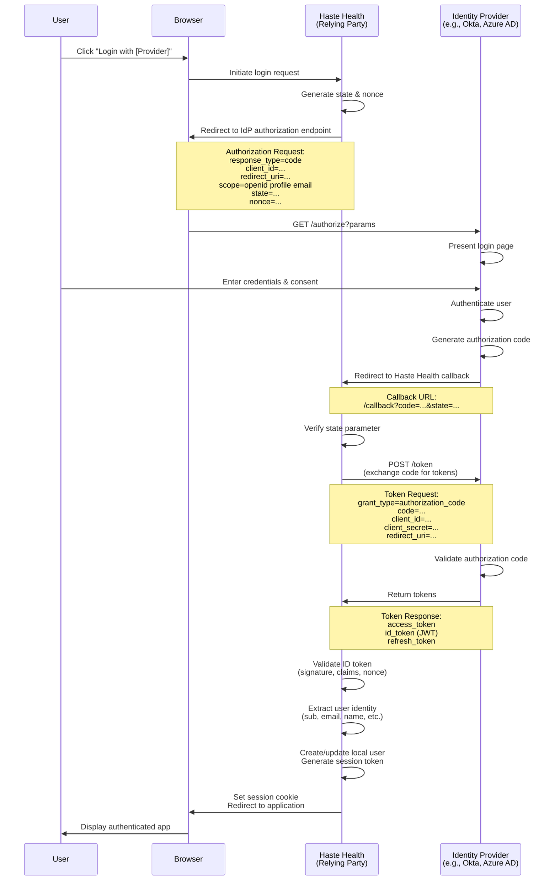

# Federated Login with OpenID Connect

Federated login allows users to authenticate using their existing identity from external identity providers (IdPs) rather than creating new credentials for Haste Health. This is implemented using OpenID Connect (OIDC), an identity layer built on top of OAuth 2.0.

## Overview

With federated login, Haste Health acts as a Relying Party (RP) that trusts external Identity Providers to authenticate users. Common identity providers include:

- **Enterprise IdPs**: Okta, Auth0, Azure AD, Google Workspace
- **Healthcare IdPs**: Epic MyChart, Cerner Patient Portal
- **Social IdPs**: Google, Microsoft, Apple
- **Government IdPs**: Login.gov, ID.me

## How Federated Login Works

The federated login flow involves three parties:

1. **User (Resource Owner)**: The end user attempting to access Haste Health
2. **Haste Health (Relying Party/Client)**: The application requesting authentication
3. **Identity Provider (Authorization Server)**: The external system that authenticates the user

### OIDC Authorization Code Flow



## Configurationz
### Google

```javascript
{
  "issuer": "https://accounts.google.com",
  "authorizationEndpoint": "https://accounts.google.com/o/oauth2/v2/auth",
  "tokenEndpoint": "https://oauth2.googleapis.com/token",
  "userInfoEndpoint": "https://openidconnect.googleapis.com/v1/userinfo",
  "jwksUri": "https://www.googleapis.com/oauth2/v3/certs",
  "scopes": ["openid", "profile", "email"]
}
```

### Microsoft Azure AD

```javascript
{
  "issuer": "https://login.microsoftonline.com/{tenant}/v2.0",
  "authorizationEndpoint": "https://login.microsoftonline.com/{tenant}/oauth2/v2.0/authorize",
  "tokenEndpoint": "https://login.microsoftonline.com/{tenant}/oauth2/v2.0/token",
  "jwksUri": "https://login.microsoftonline.com/{tenant}/discovery/v2.0/keys",
  "scopes": ["openid", "profile", "email"]
}
```

### Okta

```javascript
{
  "issuer": "https://{domain}.okta.com",
  "authorizationEndpoint": "https://{domain}.okta.com/oauth2/v1/authorize",
  "tokenEndpoint": "https://{domain}.okta.com/oauth2/v1/token",
  "userInfoEndpoint": "https://{domain}.okta.com/oauth2/v1/userinfo",
  "jwksUri": "https://{domain}.okta.com/oauth2/v1/keys",
  "scopes": ["openid", "profile", "email"]
}
```

## Troubleshooting

### Token Validation Failed

**Error**: Token signature verification failed

**Solution**:
1. Verify the JWKS URI is correct and accessible
2. Check that the token hasn't expired
3. Ensure the issuer and audience claims match expectations


## Best Practices

1. **Use Authorization Code Flow**: Most secure for web applications
2. **Implement PKCE**: Required for public clients (SPAs, mobile apps)

## Resources

- [OpenID Connect Specification](https://openid.net/specs/openid-connect-core-1_0.html)
- [OAuth 2.0 Authorization Framework](https://datatracker.ietf.org/doc/html/rfc6749)
- [PKCE Specification](https://datatracker.ietf.org/doc/html/rfc7636)
- [JWT Best Practices](https://datatracker.ietf.org/doc/html/rfc8725)