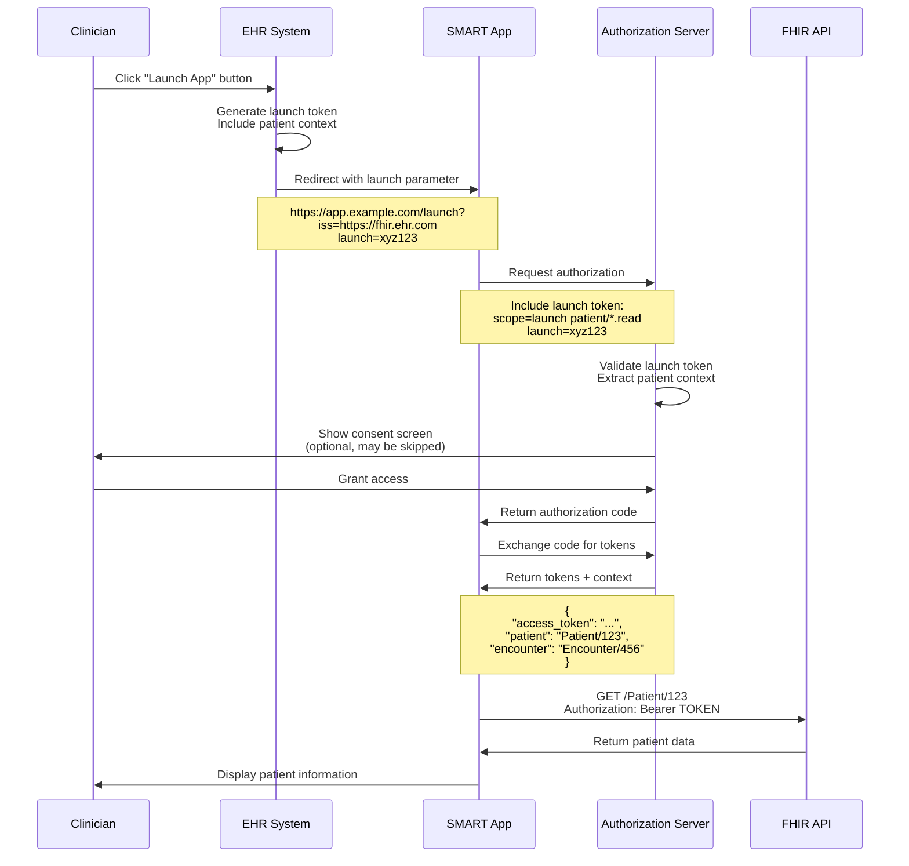
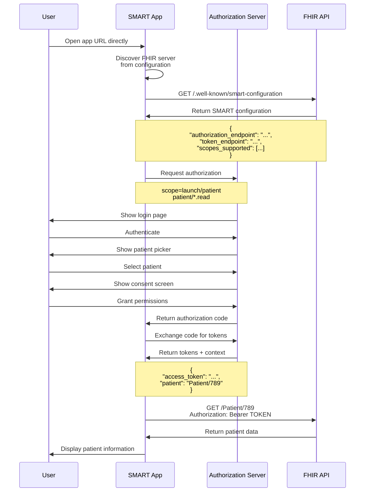

# SMART on FHIR

SMART on FHIR is a standard that enables healthcare applications to securely access patient data across different EHR systems. It builds upon OAuth 2.0 and OpenID Connect to provide healthcare-specific authentication and authorization.

## Overview

SMART on FHIR is an open standard developed by the SMART Health IT project in collaboration with HL7. It allows third-party applications to launch from within EHR systems or standalone, while maintaining consistent security and user experience across different healthcare platforms.

**Key Features:**
- **EHR Integration**: Applications can launch directly from within EHR systems
- **Standardized Scopes**: Healthcare-specific permissions using FHIR resource types
- **Patient Context**: Applications receive context about which patient's data to access
- **User Context**: Applications know which user (patient, practitioner) is authenticated
- **Interoperability**: Same app works across different EHR vendors (Epic, Cerner, etc.)

## SMART Launch Flows

SMART on FHIR supports two primary launch patterns:

### 1. EHR Launch (Contextual Launch)

The application is launched from within an EHR system, automatically receiving context about the patient and user.



**Launch URL Format:**
```
https://app.example.com/launch?
  iss=https://api.haste.health/w/{tenant}/{project}/api/v1/fhir/r4
  &launch=eyJhbGciOiJIUzI1NiIsInR5cCI6IkpXVCJ9...
```

**Authorization Request:**
```http
GET /w/{tenant}/oauth/api/v1/authorize?
  response_type=code&
  client_id=smart-app-id&
  redirect_uri=https://app.example.com/callback&
  scope=launch patient/*.read&
  state=random-state&
  aud=https://api.haste.health/w/{tenant}/{project}/api/v1/fhir/r4&
  launch=eyJhbGciOiJIUzI1NiIsInR5cCI6IkpXVCJ9...
```

### 2. Standalone Launch

The application launches independently, and the user selects which patient's data to access.



## SMART Scopes

SMART on FHIR defines a structured scope syntax that combines permissions with FHIR resource types.

### Scope Syntax

```
<context>/<resource>.<permission>
```

**Components:**
- **Context**: Who is accessing the data (`patient`, `user`, `system`)
- **Resource**: FHIR resource type (`Patient`, `Observation`, etc.) or `*` for all
- **Permission**: Access level (`read`, `write`, or `*` for both)

### Scope Categories

#### 1. Clinical Scopes (Patient Context)

Access data for the currently selected patient:

| Scope | Description |
|-------|-------------|
| `patient/*.read` | Read all patient compartment resources |
| `patient/*.write` | Write all patient compartment resources |
| `patient/*.*` | Full read/write access to patient compartment |
| `patient/Patient.read` | Read Patient demographics |
| `patient/Observation.read` | Read Observations (labs, vitals, etc.) |
| `patient/Condition.read` | Read Conditions (diagnoses) |
| `patient/MedicationRequest.read` | Read medication orders |
| `patient/AllergyIntolerance.read` | Read allergies |
| `patient/Immunization.read` | Read immunization history |
| `patient/DiagnosticReport.read` | Read diagnostic reports |
| `patient/Procedure.read` | Read procedures |
| `patient/DocumentReference.read` | Read clinical documents |
| `patient/CarePlan.read` | Read care plans |
| `patient/Goal.read` | Read patient goals |
| `patient/Encounter.read` | Read encounter history |

#### 2. User-Level Scopes

Access data across all patients the user has access to:

| Scope | Description |
|-------|-------------|
| `user/*.read` | Read all resources the user can access |
| `user/*.write` | Write all resources the user can access |
| `user/*.*` | Full read/write access for the user |
| `user/Patient.read` | Read all patients user can access |
| `user/Observation.read` | Read all observations user can access |
| `user/Practitioner.read` | Read practitioner information |
| `user/Organization.read` | Read organization information |

#### 3. System-Level Scopes

Access for backend services (Client Credentials flow):

| Scope | Description |
|-------|-------------|
| `system/*.read` | Read all resources (backend access) |
| `system/*.write` | Write all resources (backend access) |
| `system/*.*` | Full read/write system access |
| `system/Patient.read` | Read all patients (no user context) |
| `system/Observation.read` | Read all observations (no user context) |

#### 4. Launch Scopes

Control launch context and behavior:

| Scope | Description |
|-------|-------------|
| `launch` | Required for EHR launch flow |
| `launch/patient` | Request patient picker for standalone launch |
| `launch/encounter` | Request encounter context |
| `online_access` | Request refresh token for long-term access |
| `offline_access` | Request refresh token for offline/background access |

#### 5. OpenID Connect Scopes

Standard OIDC scopes for user identity:

| Scope | Description |
|-------|-------------|
| `openid` | Required for OIDC authentication |
| `profile` | User's name, picture, etc. |
| `email` | User's email address |
| `fhirUser` | FHIR resource representing the user (Patient, Practitioner, etc.) |

## Token Response with Context

When using SMART on FHIR, the token response includes additional context information:

```json
{
  "access_token": "eyJhbGciOiJSUzI1NiIsInR5cCI6IkpXVCJ9...",
  "token_type": "Bearer",
  "expires_in": 3600,
  "scope": "patient/Patient.read patient/Observation.read",
  "patient": "Patient/123",
  "encounter": "Encounter/456",
  "refresh_token": "eyJhbGciOiJSUzI1NiIsInR5cCI6IkpXVCJ9...",
  "id_token": "eyJhbGciOiJSUzI1NiIsInR5cCI6IkpXVCJ9..."
}
```

**Context Parameters:**

| Parameter | Description | Example |
|-----------|-------------|---------|
| `patient` | FHIR Patient resource ID | `Patient/123` |
| `encounter` | Current encounter context | `Encounter/456` |
| `fhirUser` | FHIR resource for authenticated user | `Practitioner/789` or `Patient/123` |
| `tenant` | Tenant identifier (if multi-tenant) | `org-acme-health` |
| `need_patient_banner` | Whether to show patient banner | `true` |
| `intent` | Launch intent (reconcile-medications, etc.) | `reconcile-medications` |

## SMART Configuration Discovery

Applications discover SMART capabilities via the `.well-known` endpoint:

**Request:**
```http
GET /.well-known/smart-configuration HTTP/1.1
Host: api.haste.health
```

**Response:**
```json
{
  "issuer": "https://api.haste.health",
  "authorization_endpoint": "https://api.haste.health/w/{tenant}/oauth/api/v1/authorize",
  "token_endpoint": "https://api.haste.health/w/{tenant}/oauth/api/v1/token",
  "token_endpoint_auth_methods_supported": [
    "client_secret_basic",
    "client_secret_post",
    "private_key_jwt"
  ],
  "registration_endpoint": "https://api.haste.health/w/{tenant}/oauth/api/v1/register",
  "scopes_supported": [
    "openid",
    "profile",
    "email",
    "fhirUser",
    "launch",
    "launch/patient",
    "launch/encounter",
    "online_access",
    "offline_access",
    "patient/*.read",
    "patient/*.write",
    "user/*.read",
    "user/*.write",
    "system/*.read",
    "system/*.write"
  ],
  "response_types_supported": [
    "code"
  ],
  "capabilities": [
    "launch-ehr",
    "launch-standalone",
    "client-public",
    "client-confidential-symmetric",
    "context-ehr-patient",
    "context-ehr-encounter",
    "context-standalone-patient",
    "context-standalone-encounter",
    "permission-offline",
    "permission-patient",
    "permission-user",
    "permission-v2"
  ],
  "code_challenge_methods_supported": [
    "S256"
  ],
  "grant_types_supported": [
    "authorization_code",
    "refresh_token",
    "client_credentials"
  ]
}
```

#
## SMART Capabilities

### Supported Capabilities

Haste Health supports the following SMART capabilities:

| Capability | Description | Supported |
|------------|-------------|-----------|
| `launch-standalone` | Supports standalone launch | ✅ Yes |
| `client-public` | Supports public clients (no secret) | ✅ Yes |
| `client-confidential-symmetric` | Supports confidential clients with secret | ✅ Yes |
| `context-standalone-patient` | Patient picker in standalone launch | ✅ Yes |
| `permission-offline` | Supports offline_access scope | ✅ Yes |
| `permission-patient` | Supports patient/* scopes | ✅ Yes |
| `permission-user` | Supports user/* scopes | ✅ Yes |
| `permission-v2` | SMART v2 scope syntax | ✅ Yes |

## Common Use Cases

### Patient Portal

```javascript
// Patient viewing their own data
scope: 'openid profile patient/Patient.read patient/Observation.read patient/Condition.read patient/MedicationRequest.read online_access'
```

### Clinical Decision Support

```javascript
// CDS app launched from EHR
scope: 'launch patient/Patient.read patient/Observation.read patient/Condition.read patient/MedicationRequest.read patient/AllergyIntolerance.read'
```

### Population Health

```javascript
// Analytics dashboard for clinicians
scope: 'openid profile user/Patient.read user/Observation.read user/Condition.read user/Encounter.read'
```

### Research Data Export

```javascript
// Backend system for de-identified data
scope: 'system/Patient.read system/Observation.read system/Condition.read system/Procedure.read'
```

## Resources

- [SMART App Launch Framework](http://hl7.org/fhir/smart-app-launch/)
- [SMART App Launch v2.0.0](http://hl7.org/fhir/smart-app-launch/STU2/)
- [SMART Backend Services](http://hl7.org/fhir/smart-app-launch/backend-services.html)
- [FHIR Client JS Library](https://github.com/smart-on-fhir/client-js)
- [SMART on FHIR Sandbox](https://launch.smarthealthit.org/)
