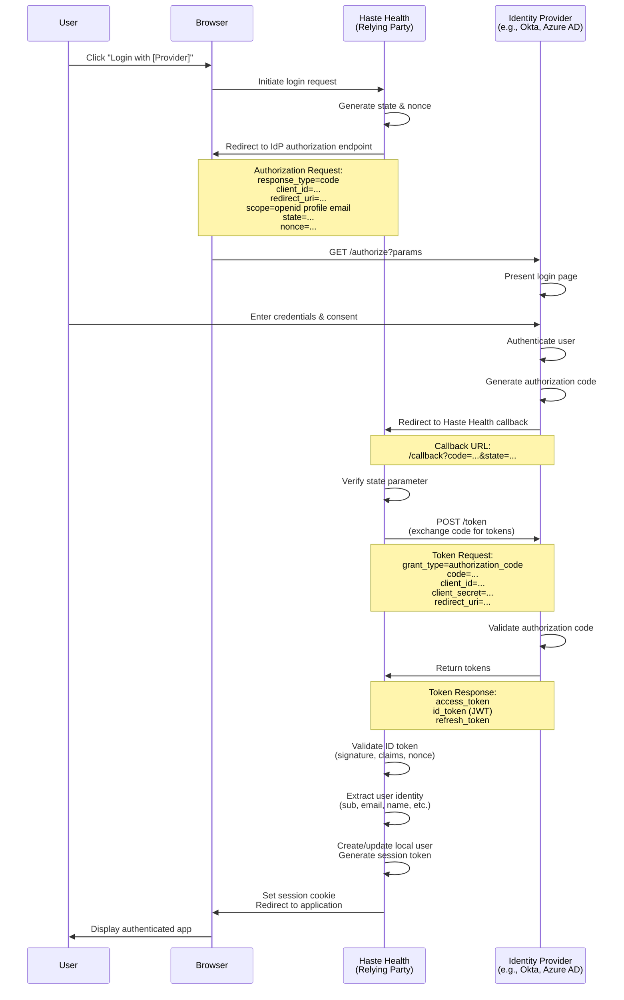

# Federated Login with OpenID Connect

Federated login allows users to authenticate using their existing identity from external identity providers (IdPs) rather than creating new credentials for Haste Health. This is implemented using OpenID Connect (OIDC), an identity layer built on top of OAuth 2.0.

## Overview

With federated login, Haste Health acts as a Relying Party (RP) that trusts external Identity Providers to authenticate users. Common identity providers include:

- **Enterprise IdPs**: Okta, Auth0, Azure AD, Google Workspace
- **Healthcare IdPs**: Epic MyChart, Cerner Patient Portal
- **Social IdPs**: Google, Microsoft, Apple
- **Government IdPs**: Login.gov, ID.me

## How Federated Login Works

The federated login flow involves three parties:

1. **User (Resource Owner)**: The end user attempting to access Haste Health
2. **Haste Health (Relying Party/Client)**: The application requesting authentication
3. **Identity Provider (Authorization Server)**: The external system that authenticates the user

### OIDC Authorization Code Flow



## Assigning access on first sign-in

The first time a user signs in through an identity provider, Haste Health creates a `User` and a `Membership` for them. Without an access policy, that user can't read or write anything until an administrator assigns one.

A project can assign policies automatically with `Project.identityProviderSetting`:

```json
{
  "resourceType": "Project",
  "id": "my-project",
  "name": "My Project",
  "fhirVersion": "4.0.1",
  "identityProvider": [{ "reference": "IdentityProvider/okta" }],
  "identityProviderSetting": [
    {
      "identityProvider": { "reference": "IdentityProvider/okta" },
      "defaultAccessPolicy": [
        { "reference": "AccessPolicyV2/clinician-read" }
      ]
    }
  ]
}
```

When a user first signs in through `IdentityProvider/okta`, one `AccessPolicyV2Assignment` is created per listed policy, linked to that user's new `Membership`, in the same transaction that creates the user. The policies apply as soon as the user gets a token.

This runs only when the user is created. Later sign-ins don't change existing assignments, so an assignment an administrator removes is not recreated, and changing `defaultAccessPolicy` does not affect users who have already signed in.

The identity provider must also be listed in `Project.identityProvider`; a setting for any other provider is ignored.

## Setup Guides
- [Okta Integration Guide](/docs/integration/identity_providers/okta)
- [Azure AD Integration Guide](/docs/integration/identity_providers/azure)
- [GCP Integration Guide](/docs/integration/identity_providers/gcp)
- [Auth0 Integration Guide](/docs/integration/identity_providers/auth0)
- [Keycloak Integration Guide](/docs/integration/identity_providers/keycloak)
- [Haste Health Integration Guide](/docs/integration/identity_providers/haste-health)

## Scopes

`IdentityProvider.oidc.scopes` is sent to the provider's authorization endpoint.
`openid` is always requested, whether or not it is listed, because the callback
identifies the user from the `sub` claim of the id token and a provider only
returns an id token for an OIDC request.

The client registered with the provider must also be allowed those scopes. A
provider that refuses one of them sends the user back to the callback with an
error instead of a code, and the sign-in fails with that error.

Add `profile` and `email` to store the user's name and email address on the
`User` resource. They are read from the id token when the user is first created;
without them the user is created with only its federated id.

## Troubleshooting

### No id token returned

**Error**: Identity provider did not return an id token

**Solution**: Register the provider's client for the `openid` scope. Some
providers only return an id token when the client is explicitly allowed it.

### Token Validation Failed

**Error**: Token signature verification failed

**Solution**:
1. Verify the JWKS URI is correct and accessible
2. Check that the token hasn't expired
3. Ensure the issuer and audience claims match expectations


## Best Practices
1. **Use Authorization Code Flow**: Most secure for web applications
2. **Use PKCE**: Adds security for public clients

## Resources

- [OpenID Connect Specification](https://openid.net/specs/openid-connect-core-1_0.html)
- [OAuth 2.0 Authorization Framework](https://datatracker.ietf.org/doc/html/rfc6749)
- [PKCE Specification](https://datatracker.ietf.org/doc/html/rfc7636)
- [JWT Best Practices](https://datatracker.ietf.org/doc/html/rfc8725)