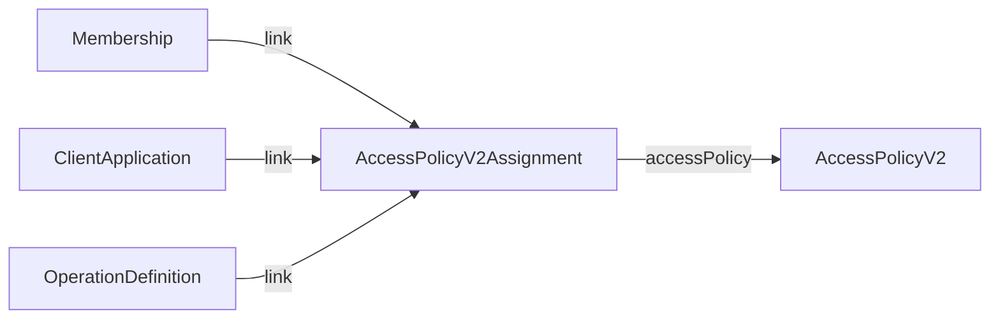

# Access Control

Haste Health's attribute-based access control (ABAC) uses two resources: **AccessPolicyV2** defines a rule, and **AccessPolicyV2Assignment** says who it applies to.



A Membership, ClientApplication, or OperationDefinition can have several assignments; each assignment points at exactly one policy. Assignments can be added or removed without touching the policy itself, and one policy can be assigned to many things at once.

## AccessPolicyV2

Defines what's allowed.

| Field | Meaning |
| --- | --- |
| `name` | Human-readable label |
| `engine` | `full-access` or `rule-engine` — see [Policy Engines](#policy-engines) |
| `rule` | The rule-engine's conditions (only used when `engine` is `rule-engine`) |

**[Full schema →](/docs/reference/fhir/model/resources/AccessPolicyV2)**

## AccessPolicyV2Assignment

Connects a policy to what it applies to.

| Field | Meaning |
| --- | --- |
| `accessPolicy` | Reference to the `AccessPolicyV2` being granted |
| `link` | Reference to a `Membership`, `ClientApplication`, or `OperationDefinition` |

```json
{
  "resourceType": "AccessPolicyV2Assignment",
  "accessPolicy": { "reference": "AccessPolicyV2/policy-id" },
  "link": { "reference": "Membership/membership-id" }
}
```

:::warning[Deprecated]
`AccessPolicyV2.target.link` did this same job before `AccessPolicyV2Assignment` existed. Policies still using it keep working, but write new ones with an assignment instead.
:::

**[Full schema →](/docs/reference/fhir/model/resources/AccessPolicyV2Assignment)**

## Policy Engines

### Full Access

**`engine: "full-access"`** — grants everything. For admins and service accounts.

```json
{
  "resourceType": "AccessPolicyV2",
  "id": "admin-full-access",
  "name": "Admin Full Access",
  "engine": "full-access"
}
```

### Rule Engine

**`engine: "rule-engine"`** — evaluates FHIRPath rules against the request.

#### Variables available in rules

- `%user.id` — the authenticated user's id
- `%request` — the incoming request:
  - `level` — `instance`, `type`, or `system`
  - `type` — `create` \| `read` \| `vread` \| `update` \| `patch` \| `delete` \| `search` \| `history` \| `invoke` \| `batch` \| `transaction` \| `compartment` \| `capabilities`
  - `resource_type`, `id`, `resource`, `parameters` — only present where that request shape has them (e.g. `id` on a `Read`, not on a `Search`)

#### Attributes: pulling in other data

An `attribute` runs a `read`, `search-type`, or `search-system` and makes the result available as `%<attributeId>`:

```json
"attribute": [
  {
    "attributeId": "target",
    "operation": {
      "type": "read",
      "path": {
        "language": "text/fhirpath",
        "expression": "%request.resource_type + '/' + %request.id"
      }
    }
  }
]
```

This reads the resource the request is acting on and makes it available as `%target` — useful for a rule that needs to look at the resource's own fields (e.g. "is `%target.subject` the caller's own patient?").

#### Rules: permit or deny

Each rule has an optional `target` (should this rule run at all?) and a `condition` (does it pass?):

```json
{
  "resourceType": "AccessPolicyV2",
  "name": "Reads only",
  "engine": "rule-engine",
  "rule": [
    {
      "name": "Allow reads",
      "condition": {
        "expression": {
          "language": "text/fhirpath",
          "expression": "%request.type = 'read'"
        }
      }
    }
  ]
}
```

- **effect**: `permit` (default) or `deny`
- **combineBehavior**: `all-of` (every child rule must pass) or `any` (one is enough)

## Policy Evaluation

1. At login, the token is stamped with the version IDs of every `AccessPolicyV2` reachable through the user's (or client's) `AccessPolicyV2Assignment`s
2. Each request loads those policies and runs each one's engine
3. **Any** policy granting access is enough — the request is denied only if every policy denies

## Best Practices

- **Least privilege** — start restrictive, add exceptions as needed
- **Layer policies** — a base policy for common access, narrow ones for exceptions
- **Test before shipping** — use `$evaluate-policy` against real and edge-case requests
- **Name things clearly** — a FHIRPath condition isn't self-explanatory later

## Related Documentation

- **[Membership](/docs/auth/authorization/membership)** — what usually gets assigned a policy
- **[Scopes](/docs/auth/authorization/scopes)** — coarser, OAuth-scope-based permissions
- **[AccessPolicyV2 schema](/docs/reference/fhir/model/resources/AccessPolicyV2)**
- **[AccessPolicyV2Assignment schema](/docs/reference/fhir/model/resources/AccessPolicyV2Assignment)**
