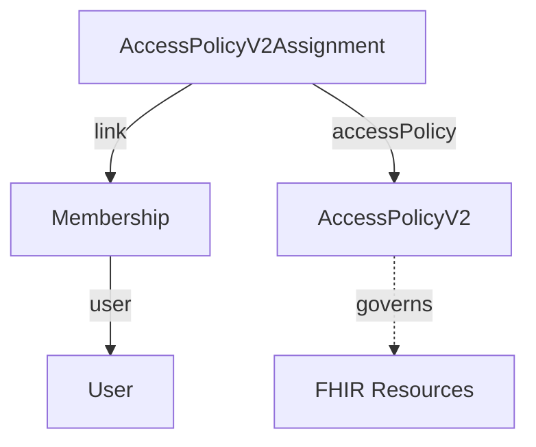

# Identity & Access Control

Four resources manage identity and authorization across projects: **User** is who you are, **Membership** is which project you're in, and **AccessPolicyV2** (connected via **AccessPolicyV2Assignment**) is what you can do there.

## User

An authenticated identity, at the tenant level.

- **email** — unique identifier for authentication
- **role** — tenant-level role: `admin`, `member`, or `owner`
- **federated** — optional link to an external identity provider (SSO/OIDC)

Users live in the System Project and reach other projects through Memberships.

**[Schema →](/docs/reference/fhir/model/resources/User)**

## Membership

Links a User to a Project, granting project-level access.

- **user** — reference to the `User`
- **link** — optional reference to the clinical resource this membership represents (`Patient`, `Practitioner`, `RelatedPerson`, or `Person`)

Without a Membership, a User can't access a project's resources (unless they're a tenant `owner`/`admin`). A Membership alone only grants entry — what it can then do is decided by whatever `AccessPolicyV2` its `AccessPolicyV2Assignment`s point at.

**[Membership details →](/docs/auth/authorization/membership)** · **[Schema →](/docs/reference/fhir/model/resources/Membership)**

## AccessPolicyV2 and AccessPolicyV2Assignment

**AccessPolicyV2** defines what's allowed; **AccessPolicyV2Assignment** connects that policy to a Membership (or a `ClientApplication`/`OperationDefinition` for non-user callers).

- **AccessPolicyV2.engine** — `full-access` or `rule-engine`
- **AccessPolicyV2Assignment.accessPolicy** — reference to the policy
- **AccessPolicyV2Assignment.link** — reference to the Membership/ClientApplication/OperationDefinition it's granted to

At login, the system finds every `AccessPolicyV2Assignment` linking to the caller's Membership and stamps those policies' version IDs into the access token; each request then evaluates all of them, and **any** one granting access is enough.

:::warning[Deprecated]
`AccessPolicyV2.target.link` did this same job before `AccessPolicyV2Assignment` existed. Still honored, but write new policies with an assignment instead.
:::

**[Access control details →](/docs/auth/authorization/access_control)** · **[AccessPolicyV2 schema →](/docs/reference/fhir/model/resources/AccessPolicyV2)** · **[AccessPolicyV2Assignment schema →](/docs/reference/fhir/model/resources/AccessPolicyV2Assignment)**

## Related Documentation

- **[Authorization Overview](/docs/auth/authorization/intro)** — the complete authorization system
- **[Multi-Tenant Architecture](/docs/core_concepts/platform_architecture)** — tenant and project structure
- **[Authentication](/docs/category/oauth-grant-types)** — OAuth 2.0 and OIDC flows
