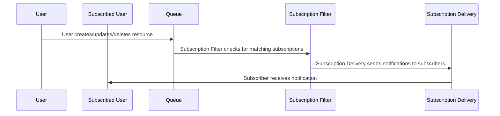

# [RFC] FHIR Subscriptions

## Abstract
FHIR Subscriptions are FHIR resources which define a mechanism for clients to receive notifications about changes to resources that match certain criteria. 
This allows clients to stay up-to-date with changes in the server without having to continuously poll for updates.
However, implementing FHIR Subscriptions can be complex and may require significant changes to the server architecture.

## Background
**R4:**
The data model for a FHIR Subscription is defined [here](/docs/reference/fhir/model/resources/Subscription).
This is the `normal` approach for handling in R4.

**R4 Backport:**
With R5 they did a complete redesign and offer a backport to R4 the following is the [implementation guide](https://build.fhir.org/ig/HL7/fhir-subscription-backport-ig/).

The main difference between the R4 Backport and R4 is the backport decouples 
subscribers from the subscription resource and instead uses a separate `SubscriptionTopic` resource to define the criteria for notifications.

## Problem
How to implement FHIR Subscriptions in a way that is efficient, scalable, and maintainable while also adhering to the FHIR specification.

## Proposal

Terminology:
- Queue: Abstract queue which delivers resources
- Subscription Filter: Worker/s which filter for resources which match a FHIR Subscriptions criteria.
- Subscription Delivery: Worker/s which deliver resources to subscribers.

## Alternative Solutions `<Optional>`
Describe any alternative solutions that were considered and why they were not chosen.

## Migration Plan `<Optional>`
Describe how the changes will be rolled out and what impact they will have on existing systems.